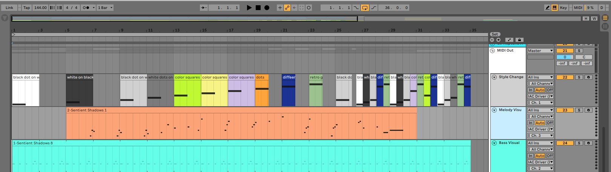

# processing-audio-visualizer
An audio visualizer, written in Processing.

## Example ##

 

## Pre-requisite ##
This uses The MidiBus library for handling Midi input. You'll need to install the MidiBus library through the Processing UI. More info here: https://github.com/sparks/themidibus

## About ##
This visualizer currently works by reading Midi data from all Midi channels and altering visual properties based on the notes. In the case of the video above, the song was composed in Ableton Live, a digital audio workstation (DAW). The Midi tracks that drive the two main components of the song, the bass and melody, were duplicated, and routed to the IAC Midi driver. This allows other programs to receive the Midi data, including this Processing app. A third output Midi channel, mapped to channel 1, was created to drive the style and visual properties. The code treats channel 1  special, cycling between different styles based on the value of that chanel. In general, it is fairly simple to create arbitrary Midi channels from your DAW that can be read by your own code that responds to Midi channels differently.

 

It's also possible to 'arm' the Midi track and route Midi input from a keyboard directly to the visualization. 

Thanks for taking a look! I'll be slowly adding to it. In particular, I would like to add some FFT / audio waveform analysis as well to drive visualizations.

